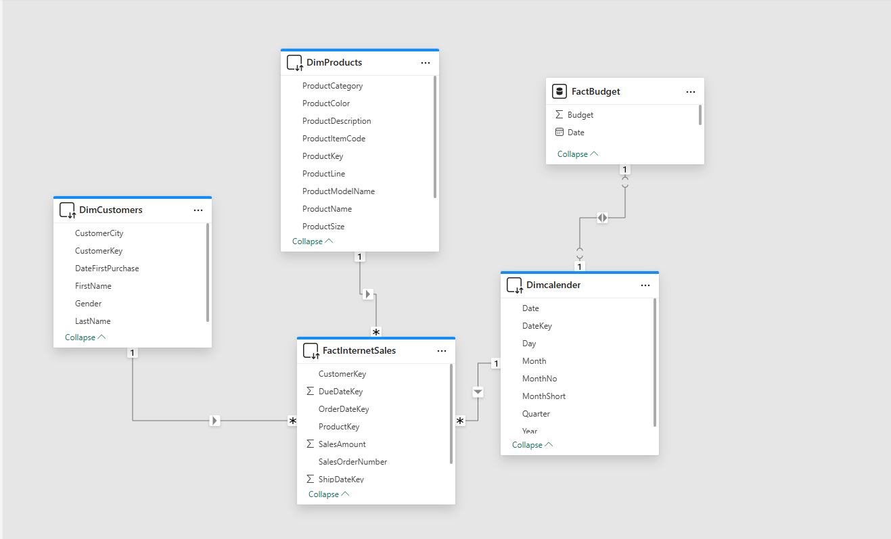

# 📊 Sales Analytics & Strategic Planning Dashboard

This project is a **Power BI-based Sales Analytics and Strategic Planning solution** developed as a mock proof-of-concept (PoC) based on a fictional business case. It demonstrates how raw SQL data and business requirements can be transformed into insightful, interactive dashboards.

---

## 🧾 Project Objective

The goal was to move from static Excel-based reporting to **dynamic Power BI dashboards** for a Sales Manager (Steven) and his team. The key business questions answered:

- What products are selling the most?
- Who are our top customers?
- How are sales tracking over time?
- How does performance compare to the annual sales budget?

---

## 💡 Tools & Technologies Used

- **Microsoft SQL Server** – For data modeling and transformation
- **T-SQL** – To create fact and dimension tables
- **Power BI** – For building dynamic dashboards using Direct Query
- **Excel / CSV** – For handling budget data provided by the client

---

## 🧠 Business Requirements

The client provided two documents:

1. 📄 `Example Business Request.docx` – outlines the sales team's high-level reporting needs
2. 📄 `Business Demand Overview & User Stories.docx` – structured user stories for targeted feature delivery

### 🧑‍💼 User Stories Summary:

| Role                 | Need                                     | Value Added                                             |
| -------------------- | ---------------------------------------- | ------------------------------------------------------- |
| Sales Manager        | Visual overview of internet sales        | Monitor top-selling products/customers; track vs budget |
| Sales Representative | Product-level view with filtering        | Identify strong and weak performing SKUs                |
| Sales Representative | Customer-level view with filtering       | Identify loyal customers and upsell opportunities       |
| Sales Manager        | Compare actual sales against 2021 budget | Evaluate team performance against targets               |

---

## 🗂️ Repository Structure

```plaintext
project_root/
│
├── dashboards/                      # Contains screenshots of Power BI dashboards
│   ├── customers_dashboard.png
│   ├── products_dashboard.png
│   └── sales_dashboard.png
│
├── SQL_code/                        # Contains SQL transformation scripts
│   ├── fact_InternetSales.sql
│   ├── dim_products.sql
│   ├── dim_customers.sql
│   └── dim_calendar.sql
│
├── table_csv/                       # Contains source CSV files
│   └── SalesBudget.csv
│
├── AdventureWorksDW2020.bak         # Sample SQL database used (import into MS SQL Server)
│
├── Business Demand Overview & User Stories.docx   # User stories and acceptance criteria
├── Example Business Request.docx                  # Original request from Sales Manager
│
├── sales_dashboard.pbix             # Main Power BI file containing all dashboards
└── SalesBudget.xlsx                 # Budget data file used in Power BI for KPI comparison

```

---

## 🛠️ Data Preparation & Transformation Process

To meet the client’s request for visual, filterable dashboards that show internet sales by product, customer, and over time (compared to budget), we performed a series of structured data transformation steps.

All requirements are based on the provided documents:

- 📄 `Example Business Request.docx`
- 📄 `Business Demand Overview & User Stories.docx`

---

### 🔹 Step 1: Load the AdventureWorksDW2020 Sample Database

- Since this was a PoC project, we simulated a real-world enterprise database using `AdventureWorksDW2020.bak`.
- This backup was restored in **Microsoft SQL Server**.
- ✅ **Client Need Addressed**: "We want to analyze historical internet sales from the past 2 years."

---

### 🔹 Step 2: Filter and Clean Internet Sales Data

**File:** `SQL_code/fact_InternetSales.sql`

- Extracted data from the `FactInternetSales` table.
- Filtered only records from **2019 to 2021**, matching the business requirement of focusing on the last 2 years.
- Removed unused columns to simplify the dataset.
- ✅ **Client Need Addressed**: "Improve our internet sales reports and show trends over time."

---

### 🔹 Step 3: Create Dimension Tables

**Files:**

- `SQL_code/dim_products.sql`
- `SQL_code/dim_customers.sql`
- `SQL_code/dim_calendar.sql`

Each dimension was cleaned and optimized based on report filtering needs:

| Dimension       | Purpose                                            | Requirement                           | SQL Script          |
| --------------- | -------------------------------------------------- | ------------------------------------- | ------------------- |
| `dim_products`  | Cleaned product info with category/subcategory     | "Show what products are selling"      | `dim_products.sql`  |
| `dim_customers` | Cleaned customer table (removed irrelevant fields) | "Which clients are buying"            | `dim_customers.sql` |
| `dim_calendar`  | Custom calendar for 2019–2021                      | "Analyze sales over time and by year" | `dim_calendar.sql`  |

---

### 🔹 Step 4: Load Budget Data

**File:** `table_csv/SalesBudget.csv`

- The client shared their 2021 **sales budget** in an Excel file.
- Converted to CSV for easy integration into Power BI.
- Used for KPI calculations like Sales vs Budget.
- ✅ **Client Need Addressed**: "Compare sales performance against 2021 budget."

---

### 🔹 Step 5: Connect Power BI via DirectQuery

**File:** `sales_dashboard.pbix`

- All SQL views and tables were loaded into Power BI using **DirectQuery**.
- This allows real-time syncing—any updates in SQL are reflected in Power BI.
- ✅ **Client Need Addressed**: "A dashboard that updates data once a day."

---

### 🔹 Step 6: Build Data Model in Power BI

- Linked all fact and dimension tables appropriately:
  - `FactInternetSales` ↔ `dim_products`, `dim_customers`, `dim_calendar`
  - `SalesBudget` ↔ `dim_calendar`
- Ensured **one-to-many relationships** were properly set with correct keys.

📌 **Data Model Screenshot**:
The final Power BI data model is shown below.



✅ **Client Need Addressed**: "Visualize and explore sales data by filtering products, customers, and time."

---

Each transformation step directly aligns with user stories and helps drive better insights for both **Sales Managers** and **Sales Reps**.

---

## 🚀 Key Takeaways

- This project simulates an end-to-end **real-world sales intelligence solution**.
- Translating vague client needs into structured, measurable KPIs is crucial.
- Power BI Direct Query ensures **data stays live** as underlying SQL tables update.
- The dashboards empower both sales reps and managers to make **data-driven decisions**.

---

## 📌 Future Improvements

- Add RLS (Row-Level Security) for personalized access
- Schedule data refresh using a Power BI Gateway
- Enable mobile-optimized dashboard view

---

## 🤝 Credits

Created by Ronak Mishra
Based on fictional requirements using Microsoft's AdventureWorks dataset.
